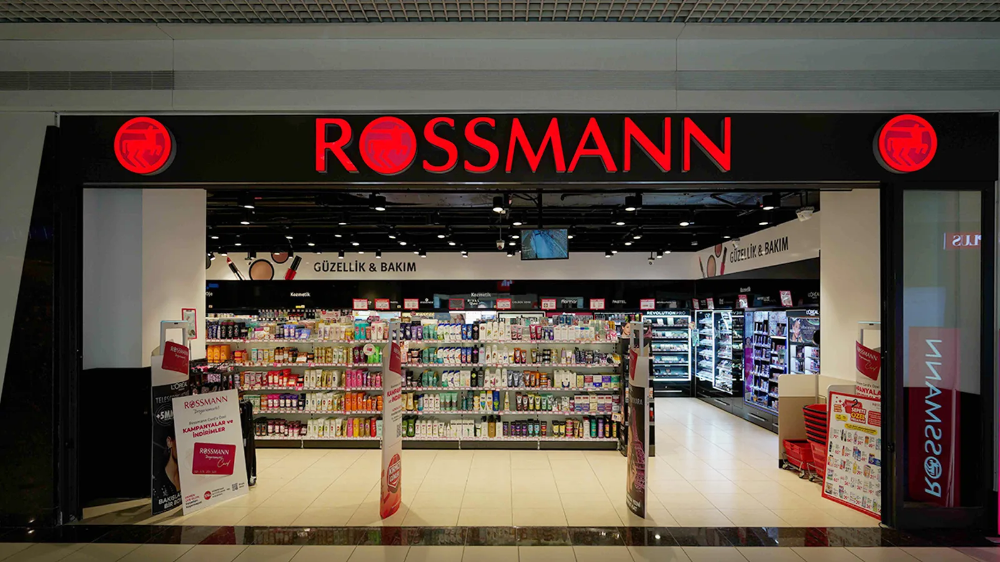
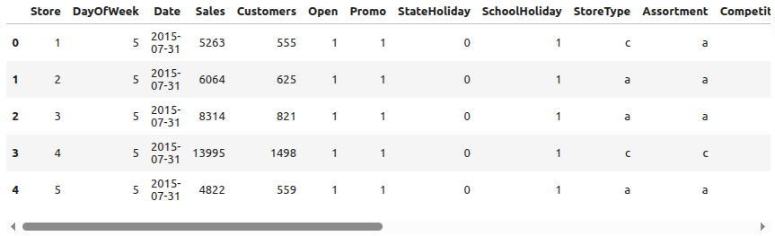
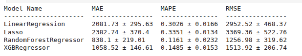
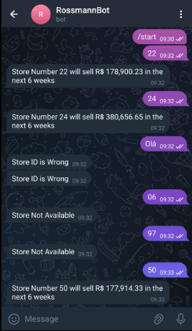
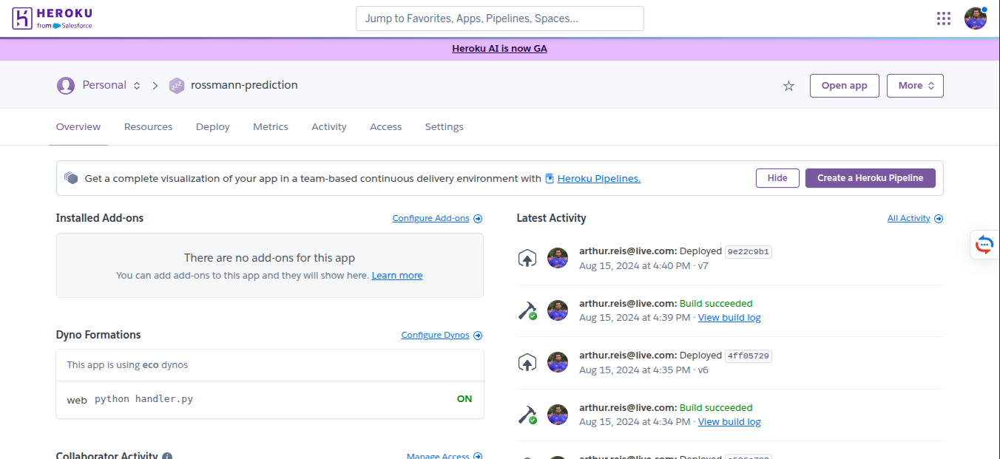

# Previsão de Vendas em Lojas Farmacêuticas

  

## Motivação

Grandes redes de varejo, como a Rossmann, precisam planejar suas vendas com precisão para tomar decisões de reforma, expansão e logística. A dificuldade está em prever como diferentes fatores — datas promocionais, feriados, concorrência e sazonalidade — impactam diretamente o faturamento de cada loja.

O projeto nasceu com o objetivo de desenvolver um modelo de **machine learning preditivo** que auxilie gestores a tomar decisões baseadas em dados, projetando o faturamento futuro de maneira confiável e prática. 

   
  <em>Figura 1: Loja Rossmann</em>

## Ferramentas Utilizadas

- **Python (Pandas, Scikit-learn, XGBoost):** para tratamento de dados, feature engineering e modelagem.
- **Flask + API REST:** integração entre modelo e sistemas externos.
- **Heroku/AWS:** deploy do modelo.
- **Telegram Bot:** interface rápida para consulta de previsões por gestores.
- **Streamlit/WebApp:** dashboard interativo para visualização. 

## Pipeline do Projeto

1. **Coleta e preparação dos dados** históricos de vendas.
2. **Análise exploratória** para entender padrões sazonais, feriados e promoções.
3. **Engenharia de atributos** (variáveis de calendário, tendência de vendas, etc.).
4. **Treinamento do modelo preditivo** com XGBoost.
5. **Validação** com métricas de erro (RMSE, MAPE).
6. **Deploy do modelo** via API Flask.
7. **Integrações**: consultas rápidas no **Telegram Bot** e análises completas no **WebApp**.

## Desenvolvimento do Modelo  

O desenvolvimento foi feito em um notebook que documenta cada etapa do processo de ciência de dados.

A primeira fase consistiu na coleta e inspeção inicial dos dados. A base histórica da Rossmann incluía informações diárias de vendas por loja, variáveis de promoções, feriados e características de cada filial. O objetivo inicial foi entender a estrutura da base, identificar inconsistências e levantar hipóteses de padrões sazonais.

   
  <em>Figura 2: Exemplo do Dataset</em>

A segunda fase envolveu o tratamento e limpeza dos dados. Valores ausentes foram corrigidos, tipos de variáveis ajustados e datas normalizadas. Algumas colunas irrelevantes ou com excesso de dados faltantes foram descartadas, reduzindo ruído e simplificando o dataset.

A terceira fase foi a análise exploratória. Gráficos de séries temporais mostraram tendências claras de sazonalidade, além de variações em feriados e promoções. Também ficou evidente como algumas lojas tinham comportamentos muito diferentes de outras, o que reforçou a importância de incorporar variáveis de calendário e contexto local.

A quarta fase foi dedicada à engenharia de atributos. A partir da coluna de datas, extraí variáveis como ano, mês, semana e dia da semana. Criei indicadores para feriados e datas promocionais, além de variáveis de tendência que capturavam o comportamento de longo prazo das vendas. Esse enriquecimento aumentou a capacidade preditiva do modelo.

Na fase seguinte, de modelagem, testei diferentes algoritmos de regressão. O que apresentou melhor desempenho foi o **XGBoost**, por conseguir lidar bem com dados tabulares e capturar interações não lineares entre variáveis. O modelo foi avaliado com métricas como RMSE e MAPE, confirmando sua precisão para um contexto de negócio.

Na etapa de validação, utilizei divisão entre treino e teste e apliquei validação cruzada. As métricas mostraram que o modelo não apenas se ajustava bem aos dados históricos, mas também generalizava para novos períodos de tempo, requisito essencial em previsões de vendas.

   
  <em>Figura 3: Comparando os modelos</em>

## Deploy e Integrações  

Após validar o modelo, avancei para o deploy. Criei uma **API REST em Flask**, que permitiu transformar o modelo em um serviço acessível. A partir dessa API, construí duas integrações principais: um bot no Telegram e um WebApp.

O **bot no Telegram** foi projetado para gestores que precisassem de respostas rápidas. Bastava digitar o código da loja e o bot retornava a previsão de vendas diretamente no celular. Essa interface leve e prática mostrou a força de integrar machine learning com canais já presentes no dia a dia das pessoas.

   
  <em>Figura 4: Print do Bot do Telegram</em>

O **WebApp**, desenvolvido em Streamlit, ofereceu uma interface mais rica e detalhada. No painel, era possível visualizar as previsões em gráficos interativos, explorar diferentes lojas, analisar tendências ao longo do tempo e comparar previsões com dados históricos. Essa camada foi pensada para analistas que precisassem de um nível maior de detalhamento para embasar suas decisões.

   
  <em>Figura 4: WebApp</em>

## Resultados e Aprendizados  

O modelo conseguiu prever vendas com boa precisão, permitindo estimar receitas futuras de forma confiável. Mais do que isso, o projeto mostrou como a ciência de dados vai além da modelagem: transformar previsões em soluções práticas, como um bot no Telegram e um WebApp interativo, amplia o impacto do trabalho e conecta diretamente a análise aos tomadores de decisão.  

O principal aprendizado foi integrar ciência de dados, engenharia de software e produto em um fluxo único. Cada fase, desde a análise exploratória até o deploy em múltiplas plataformas, reforçou a importância de pensar a ciência de dados como um processo end-to-end, cujo valor só se concretiza quando os resultados chegam ao usuário final.  

