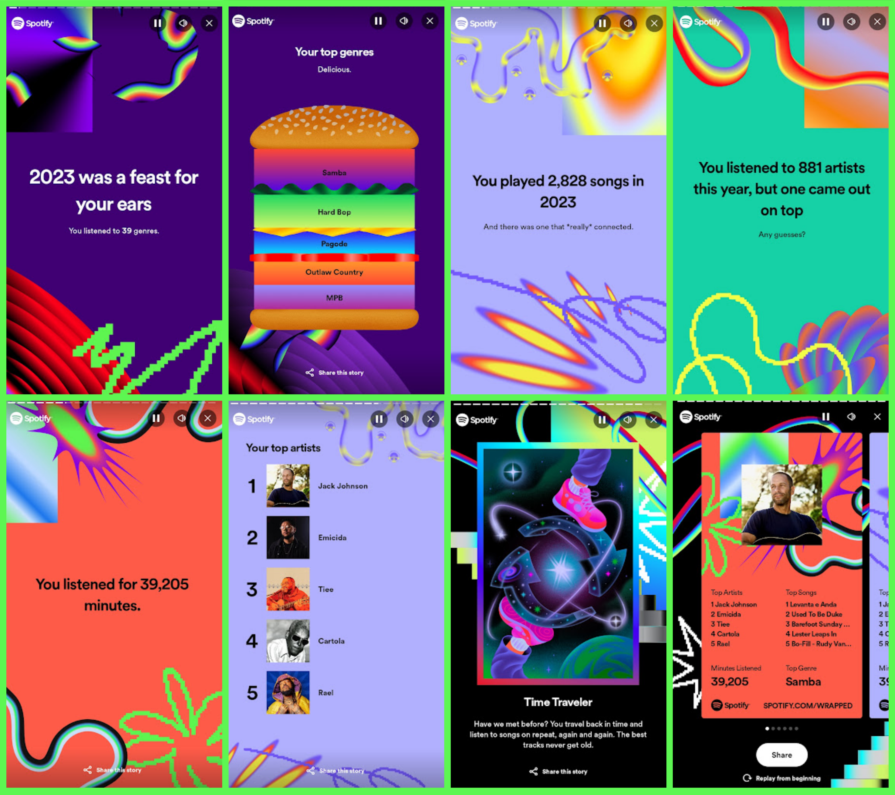
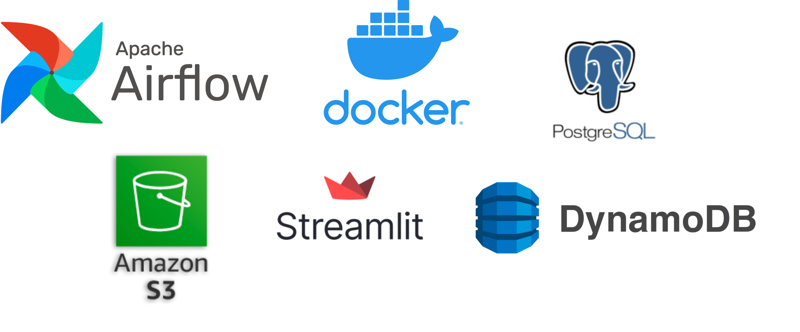
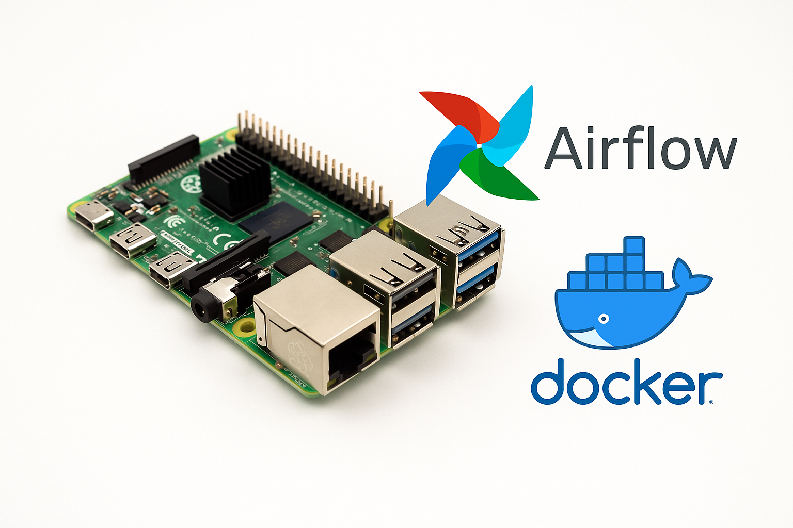
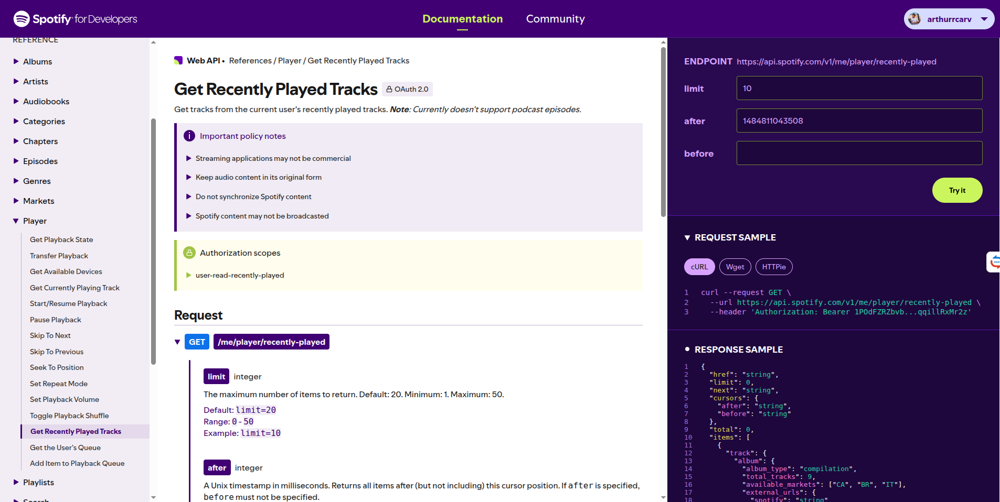
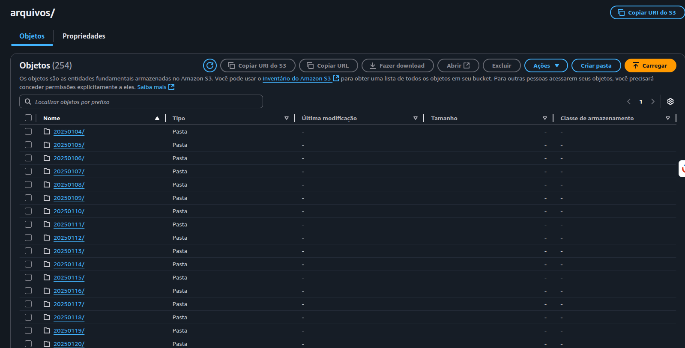
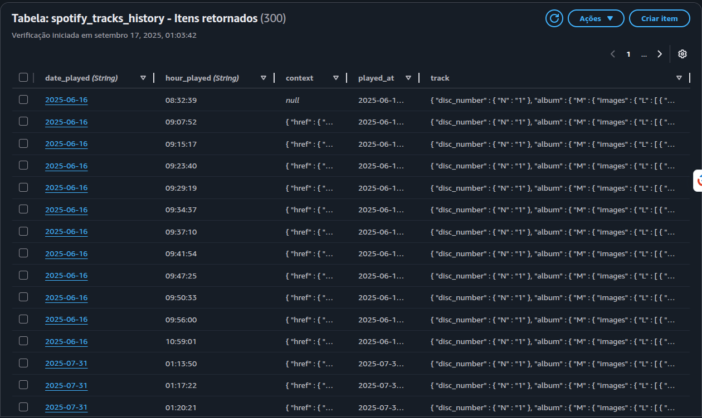
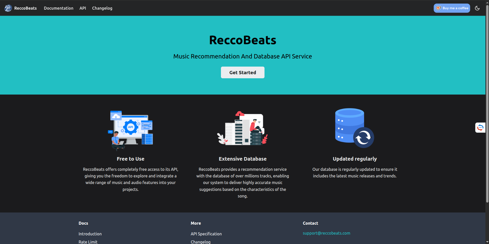
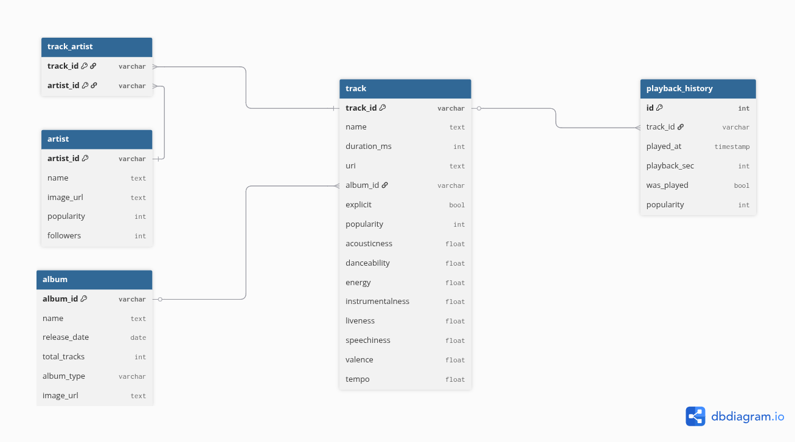
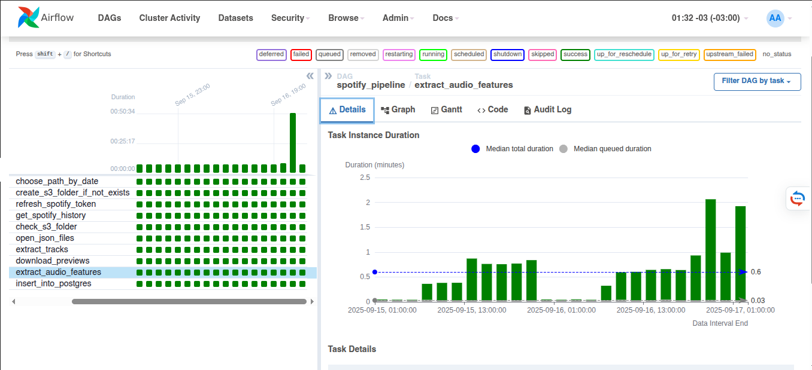
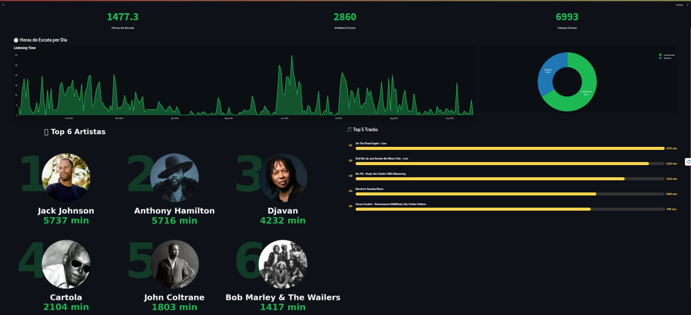

# Spotify Wrapped Pipeline

  
  &nbsp;&nbsp;&nbsp;&nbsp; <!-- Espaçamento -->
  

## Motivação

O projeto nasceu da vontade de recriar o **Spotify Wrapped** em versão própria, acessível a qualquer momento. Todos os anos, em dezembro, o Spotify apresenta um resumo colorido dos hábitos musicais de cada usuário. Apesar de divertido, ele é limitado: só acontece uma vez por ano, não permite análises semanais ou diárias e não mostra como a escuta evolui ao longo do tempo. A maior parte do histórico permanece oculta.

Minha ideia foi transformar essa lacuna em um desafio técnico. Se o Spotify armazena minhas execuções, por que eu não poderia acessá-las diretamente, estruturá-las em um banco de dados e criar meu próprio dashboard? Assim, o projeto ganhou dois objetivos complementares: de um lado, gerar relatórios personalizados que me ajudassem a entender meus hábitos de escuta; de outro, construir um **pipeline completo de engenharia de dados**, com coleta, processamento, enriquecimento e visualização.

O resultado foi um fluxo autônomo, robusto e flexível, capaz de coletar execuções quase em tempo real, enriquecer os dados com métricas acústicas e disponibilizar visualizações interativas. Mais do que reproduzir o Wrapped, esse pipeline se tornou uma vitrine prática do que é possível alcançar combinando técnicas modernas de engenharia de dados com um tema de interesse pessoal.

   
  <em>Figura 1: DAG no Airflow mostrando as tasks do pipeline.</em>

## Ferramentas Utilizadas

Para dar vida ao projeto, combinei diferentes tecnologias, cada uma cumprindo um papel específico no pipeline. O **Apache Airflow** foi o orquestrador central, responsável por coordenar as tarefas em uma DAG clara, com dependências bem definidas, retries automáticos e monitoramento visual. Essa camada deu confiabilidade ao processo, que passou a rodar em intervalos regulares de forma totalmente automatizada.

Os dados coletados da API do Spotify eram enviados ao **Amazon S3**, que funcionou como meu _data lake_ pessoal. Ali, os arquivos JSON eram armazenados exatamente como recebidos, organizados por data. Esse passo não apenas preservou os dados originais, como também assegurou a possibilidade de reprocessamentos, já que o Spotify limita o histórico a cinquenta músicas recentes.

Na sequência, utilizei o **DynamoDB** como camada inicial de persistência. Esse banco NoSQL, com escrita rápida e suporte a chaves compostas, garantiu eficiência na ingestão e evitou duplicações de registros quando o pipeline rodava em intervalos curtos.

   
  <em>Figura 2: Ferramentas utilizadas no projeto.</em>

O próximo destino foi o **PostgreSQL**, hospedado no **AWS RDS**, onde modelei um banco relacional com tabelas para artistas, álbuns, faixas, relacionamentos e histórico de execuções. Essa estrutura trouxe integridade referencial e consultas analíticas ricas, abrindo espaço para exploração avançada dos dados.

Para enriquecer a base, integrei o pipeline à **API da ReccoBeats**, que analisa arquivos de áudio e retorna atributos acústicos detalhados. Como o Spotify disponibiliza previews de trinta segundos para muitas faixas, aproveitei esses trechos em MP3 para obter métricas adicionais, adicionando uma camada que a API oficial não oferece.

Por fim, o **Streamlit**, em conjunto com **Plotly**, deu forma visual ao projeto. O dashboard apresenta rankings, distribuições temporais e análises acústicas de maneira interativa e acessível, publicado no Streamlit Cloud para ser consultado de qualquer lugar.

## Hardware

Para tornar o desafio ainda mais interessante, optei por rodar o Airflow em um **Raspberry Pi 4** com 8GB de RAM. Apesar do hardware modesto, o dispositivo funcionou muito bem como orquestrador, já que o processamento pesado era feito na nuvem. A instalação em contêineres Docker garantiu isolamento e reprodutibilidade, transformando o Pi em um pequeno datacenter pessoal. Essa escolha mostrou, na prática, que é possível executar pipelines robustos mesmo em ambientes de baixo custo, desde que se pense em eficiência e aproveitamento inteligente dos recursos.

   
  <em>Figura 3: Raspberry Pi 4.</em>

## Limitações da API do Spotify

Ao trabalhar com a API oficial do Spotify, a primeira barreira foi perceber que ela não foi feita para fornecer acesso irrestrito ao histórico de escuta. O endpoint utilizado retorna no máximo cinquenta faixas por requisição, e apenas dentro de um intervalo curto de tempo. Isso significa que, se o pipeline não rodar regularmente, as execuções mais antigas são simplesmente perdidas. Para contornar essa restrição, configurei a DAG do Airflow para rodar a cada duas horas, garantindo cobertura contínua.

   
  <em>Figura 4: Página da Documentação da API do Spotify.</em>

Outro limite importante está nos previews das músicas. O Spotify fornece trechos de trinta segundos apenas para parte do catálogo, e muitas faixas retornam `null` nesse campo. Para aproveitar ao máximo o recurso, precisei recorrer ao scraping das páginas públicas de cada faixa, extraindo do HTML o link real do preview quando disponível. Mesmo assim, há casos em que o áudio não existe, e o pipeline precisa continuar registrando a execução sem os atributos acústicos extras.

A autenticação também trouxe desafios. Como os tokens expiram rapidamente, foi necessário implementar uma rotina de renovação automática, garantindo que o acesso à API estivesse sempre válido. Essa etapa, embora simples, foi essencial para a estabilidade do pipeline.

Essas limitações mostraram que consumir a API do Spotify exige mais do que requisições diretas. É preciso lidar com dados ausentes, janelas de tempo reduzidas e autenticação volátil. Resolver essas questões foi parte importante do aprendizado: execução frequente, tratamento de exceções e automação de credenciais se tornaram peças fundamentais para manter o pipeline confiável.

## Pipeline

O pipeline segue a lógica de organizar os dados em camadas, garantindo robustez e flexibilidade. Cada etapa tem um propósito: preservar os brutos, ingeri-los rapidamente, enriquecer as faixas com atributos adicionais e consolidar tudo em um modelo relacional pronto para análise.

### Armazenamento S3

Logo após a coleta, os dados brutos são enviados para um bucket no **Amazon S3**. Essa camada funciona como um _data lake_ pessoal, guardando os arquivos JSON tal como foram recebidos. Os diretórios são organizados por data, preservando a ordem cronológica e facilitando reprocessamentos. O S3 cumpre o papel de cópia de segurança: mesmo que algo falhe nas etapas seguintes, os registros originais estão sempre disponíveis.

   
  <em>Figura 5: Estrutura no S3.</em>

### Persistência inicial no DynamoDB

Do S3, os dados passam para o **DynamoDB**, que atua como a primeira camada estruturada do pipeline. A modelagem utilizou chaves compostas por data e hora da reprodução, servindo como identificador único. Esse design evita duplicações, já que a mesma música não pode ser registrada duas vezes no mesmo intervalo. O DynamoDB também permitiu armazenar objetos complexos sem necessidade de normalização imediata, tornando a ingestão mais ágil. Assim, funcionou como uma zona de aterrissagem, absorvendo os registros recentes antes da consolidação final.

   
  <em>Figura 6: Itens no DynamoDB.</em>

### Extração de Previews e API ReccoBeats

Para enriquecer os dados além do que a API do Spotify fornece, o pipeline busca os previews de trinta segundos disponíveis em muitas faixas. Como o acesso a esses arquivos não é confiável via API oficial, utilizei scraping das páginas públicas de cada música, localizando no HTML o JSON com o link do preview. Quando disponível, o arquivo MP3 é baixado e enviado à **API da ReccoBeats**, que retorna atributos acústicos detalhados, como energia e valência. Esses dados são então combinados aos metadados do Spotify. Quando não há preview, a execução é registrada sem as features adicionais, preservando a consistência do histórico.

   
  <em>Figura 7: Página do Recco Beats.</em>

### Consolidação no PostgreSQL (AWS RDS)

A última etapa é a inserção no **PostgreSQL** hospedado no **AWS RDS**, onde os dados são organizados em modelo relacional. Criei tabelas para artistas, álbuns, faixas, associações e histórico de execuções. O uso da cláusula `ON CONFLICT DO NOTHING` garantiu que artistas, álbuns e faixas fossem registrados apenas uma vez, enquanto cada execução individual era sempre inserida no histórico. Essa modelagem trouxe integridade, eliminou redundâncias e tornou possível realizar consultas SQL ricas, base para o dashboard final.

   
  <em>Figura 8: Diagrama de Entidade Relacionamento.</em>

## A DAG no Airflow

Toda essa arquitetura foi orquestrada em uma DAG do **Apache Airflow**, chamada `spotify_pipeline`, programada para rodar a cada duas horas. O fluxo inicia com a tarefa que decide se há dados disponíveis no S3 ou se será necessário coletá-los novamente. Em seguida, o pipeline cria as pastas no bucket, renova o token de autenticação e consulta o endpoint de músicas recentemente reproduzidas.

   
  <em>Figura 9: Painel de Controle do Airflow.</em>

Os dados coletados são validados, gravados no DynamoDB e enriquecidos. Primeiro, cada JSON é processado para extrair metadados das faixas. Depois, quando possível, os previews são baixados e enviados à API da ReccoBeats para extração de atributos acústicos. Por fim, todas as informações consolidadas são inseridas no PostgreSQL.

A visualização no painel do Airflow deixa claro como os dados percorrem esse caminho. Cada tarefa aparece como um nó no fluxograma, conectado às demais por setas que indicam dependências. Essa representação gráfica foi essencial para monitorar o pipeline, identificar gargalos e confirmar a execução bem-sucedida de cada etapa. Ao final de cada execução, os dados mais recentes estavam sempre disponíveis no banco, prontos para análise no dashboard.

## Dashboard em Streamlit

Com os dados organizados e enriquecidos no PostgreSQL, o próximo passo foi transformá-los em uma ferramenta acessível e interativa. Para isso, desenvolvi um dashboard em **Streamlit**, que funciona como a vitrine final do pipeline. A ideia era simples: oferecer uma versão personalizada do Spotify Wrapped, mas atualizada em tempo quase real e com análises que a plataforma oficial não oferece.

O desenvolvimento foi direto. O Streamlit permitiu conectar consultas SQL do RDS a gráficos criados com **Plotly** e **Matplotlib**, resultando em visualizações interativas. Criei páginas dedicadas a diferentes perspectivas: ranking de artistas e músicas mais ouvidas, distribuição das execuções por horário e dia da semana, histogramas da duração das faixas e análises acústicas extraídas pela API da ReccoBeats. Essas métricas trouxeram uma dimensão nova: pude observar, por exemplo, em quais momentos do dia eu escuto músicas mais enérgicas e como os finais de semana diferem das rotinas de semana.

Publicar o aplicativo no **Streamlit Cloud** tornou o acesso ainda mais prático. De qualquer dispositivo, posso abrir o dashboard e explorar os dados sem precisar rodar nada localmente. Essa escolha deu ao projeto um caráter de produto real, pronto para ser usado, o que reforça sua utilidade além do aspecto técnico.

No fim, o dashboard não apenas confirmou que todo o pipeline estava funcionando corretamente, mas também mostrou o valor de transformar dados em insights acessíveis. Ele conectou a parte técnica à experiência do usuário final, comprovando que engenharia de dados pode — e deve — gerar resultados concretos e significativos.

   
  <em>Figura 10: Visão Geral do Dashboard</em>

## Resultados e Aprendizados

O maior resultado deste projeto foi ter criado uma versão contínua e personalizada do Spotify Wrapped. Agora consigo acompanhar meus hábitos musicais em tempo quase real, explorando padrões que antes ficavam escondidos. Percebi, por exemplo, que minhas manhãs tendem a ser marcadas por músicas mais agitadas, enquanto os finais de semana concentram execuções mais longas e variadas. O dashboard se tornou não só uma ferramenta de visualização, mas também uma forma de refletir sobre como a música se insere na minha rotina.

Do ponto de vista técnico, o projeto demonstrou que é possível construir um pipeline de ponta a ponta usando ferramentas modernas e acessíveis. O Airflow rodando em um Raspberry Pi provou que até um hardware modesto pode coordenar fluxos complexos. A integração entre S3, DynamoDB e RDS mostrou a importância de pensar em camadas, atribuindo funções específicas para cada serviço. A API da ReccoBeats trouxe uma dimensão extra, enriquecendo os dados com atributos sonoros que a API oficial não fornece.

O principal aprendizado foi lidar com limitações e encontrar soluções criativas. A restrição do histórico a cinquenta músicas exigiu agendamentos frequentes. A ausência de previews em muitas faixas mostrou a importância de projetar rotinas tolerantes a falhas. O uso combinado de bancos NoSQL e relacionais reforçou conceitos de arquitetura de dados. Cada obstáculo virou um exercício de engenharia, ampliando minha visão sobre como desenhar pipelines resilientes.

Mas talvez o aspecto mais marcante tenha sido trabalhar com dados que têm significado pessoal. O projeto deixou claro que, quando nos conectamos ao tema, o aprendizado se torna mais envolvente e profundo. Esse fator deu energia extra à execução e transformou um desafio técnico em uma experiência realmente valiosa.
